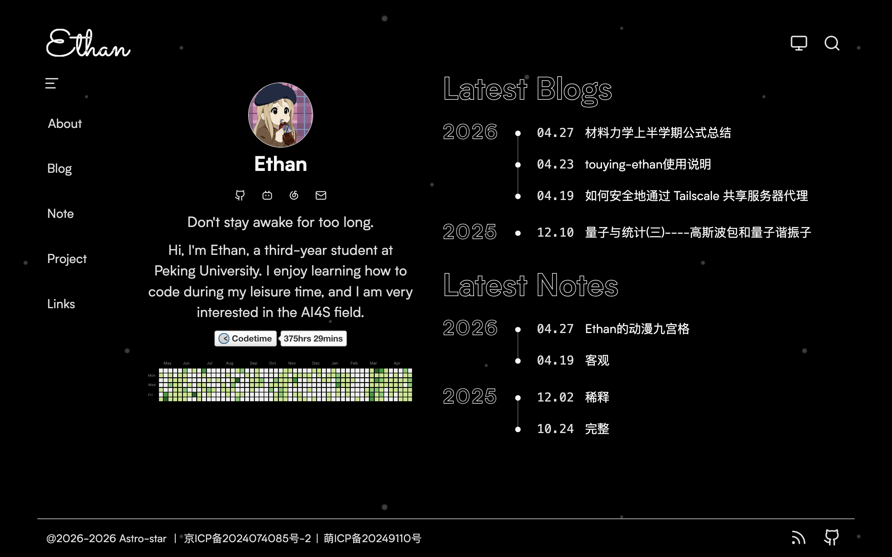
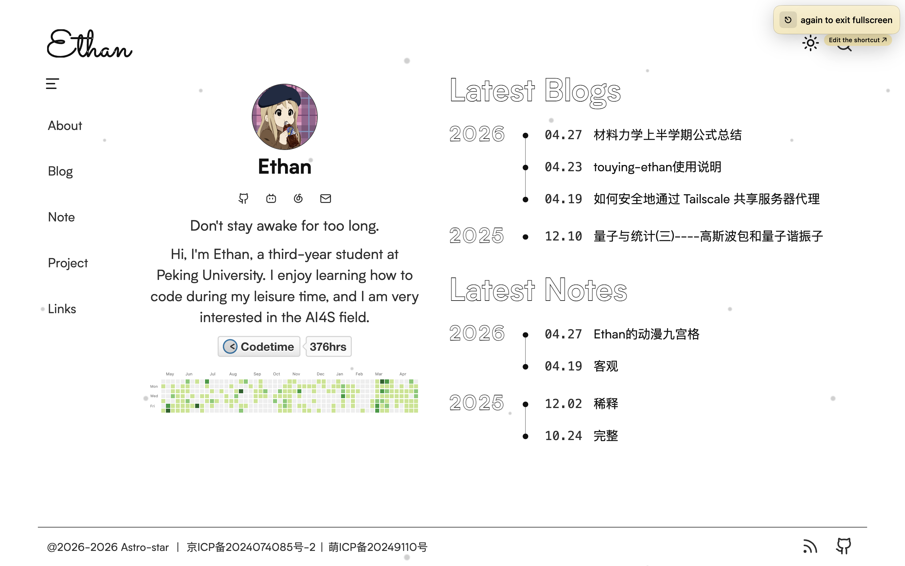
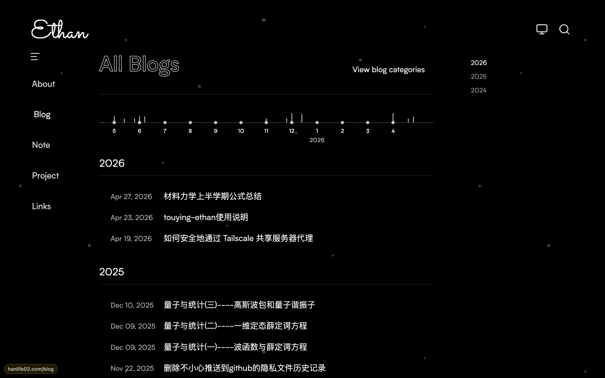
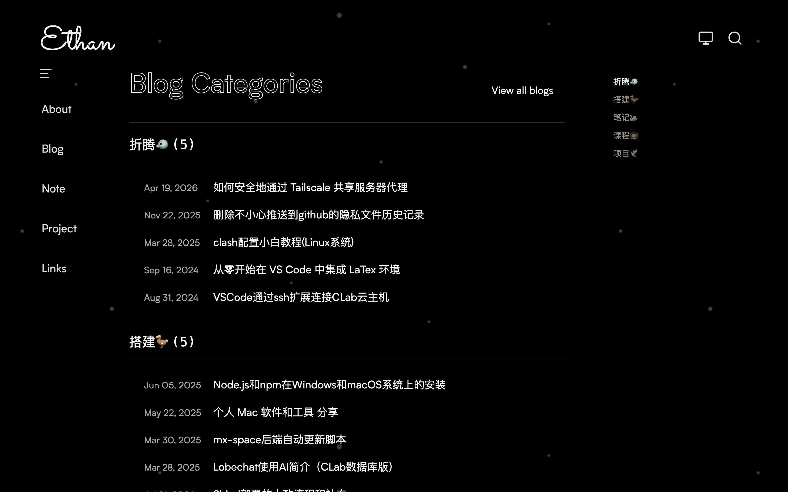
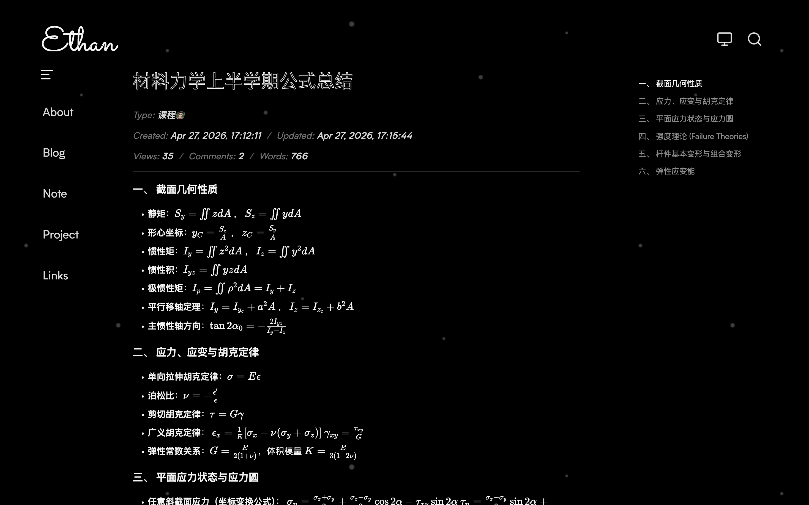
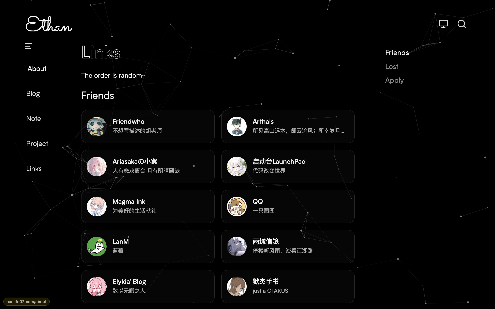

<div align="center">


# Astro-star

**An open-source Astro theme that brings blogs, notes, projects, comments, and friend links into one personal site.**

[](https://astro.build)
[](https://nodejs.org)
[](https://pnpm.io)
[](./LICENSE)
[](./CONTRIBUTING.md)

English · [简体中文](./README-zh-CN.md)

<a href="https://hanlife02.com">🌐 Live Demo</a> &nbsp;·&nbsp;
<a href="./CONTRIBUTING.md">🤝 Contributing</a> &nbsp;·&nbsp;
<a href="https://github.com/hanlife02/Astro-star/issues">🐛 Issues</a> &nbsp;·&nbsp;
<a href="https://github.com/hanlife02/Astro-star/discussions">💬 Discussions</a>

</div>

---

## Table of Contents

- [What Is This](#what-is-this)
- [Highlights](#highlights)
- [Preview](#preview)
- [Project Structure](#project-map)
- [Contributing](#build-together)
- [Tech Stack](#tech-stack)
- [License](#license)

## What Is This

Astro-star started as a personal blog and is now moving toward a community-shaped personal site theme. You can fork it as your own homepage, or bring back your fixes, components, migration notes, deployment experience, and design ideas so the next person has an easier path.

The project focuses on a small but important kind of community: independent websites that are connected by writing, notes, projects, RSS, comments, friend links, and open-source collaboration.

| If you are             | Start here                                                                                 |
| ---------------------- | ------------------------------------------------------------------------------------------ |
| Building your own site | Fork the repository, replace the personal configuration and content, then deploy your blog |
| Customizing a theme    | Reuse the layouts, routes, content collections, and design tokens                          |
| Contributing           | Fix bugs, improve docs, polish mobile views, or add reusable components                    |
| Looking for discussion | Open an Issue with ideas, screenshots, design feedback, or usage questions                 |

## Highlights

| Feature              | Description                                                                        |
| -------------------- | ---------------------------------------------------------------------------------- |
| Astro SSR            | Uses `@astrojs/node` standalone output, suitable for deployment on your own server |
| Content collections  | `blog`, `note`, and `project` are powered by Astro Content Collections             |
| Fixed site routes    | Home, About, Blog, Note, Project, and Links are built in                           |
| Theme switching      | Supports light, dark, and system modes with cookies for stable first paint         |
| MDX writing          | Supports MDX, math, KaTeX, figure captions, and custom content components          |
| Comments and links   | Includes Waline comments and a friend links page with application notes            |
| Search and feeds     | Optional Algolia site search, RSS, Sitemap, and robots.txt are included            |
| GitHub repo cards    | Content pages can display GitHub repository metadata and star counts               |
| Config migration     | Extract and restore site config, content, avatars, and article images              |
| Automated deployment | GitHub Actions builds, rsync + SSH deploys, and PM2 manages the process            |

## Preview

> 🌐 Live site: **<https://hanlife02.com>**

**Home (Dark)** | **Home (Light)**
:---:|:---:
 | 

**Blog** | **Blog Categories**
:---:|:---:
 | 

**Content** | **Friend Links**
:---:|:---:
 | 

## Project Map

```text
/
├── public/                 # Static assets, avatars, site icon, article images
├── scripts/                # Config migration, index sync, and build helpers
├── src/
│   ├── components/         # Reusable components
│   ├── config/             # Site, about, links, and search config
│   ├── content/            # blog / note / project content collections
│   ├── layouts/            # Page layouts
│   ├── pages/              # Routes and API endpoints
│   ├── scripts/            # Browser-side interaction scripts
│   ├── style/              # Global styles, component styles, design tokens
│   └── utils/              # Markdown, MDX, and shared utilities
├── astro.config.mjs
├── ecosystem.config.cjs
└── package.json
```

Top-level routes:

| Path       | Description  |
| ---------- | ------------ |
| `/`        | Home         |
| `/about`   | About        |
| `/blog`    | Blog         |
| `/note`    | Notes        |
| `/project` | Projects     |
| `/links`   | Friend links |

## Build Together

Small contributions are welcome. A clear Issue, a mobile screenshot, a reproducible bug, a more ergonomic component, or a short setup note can all make this theme easier to maintain and reuse.

| Type             | Good contributions                                                    |
| ---------------- | --------------------------------------------------------------------- |
| Bug              | Build failures, layout glitches, route issues, dark-mode problems     |
| UX polish        | Mobile layout, accessibility, interaction details, loading states     |
| Theme capability | New components, content cards, archive views, link display patterns   |
| Documentation    | Setup guides, deployment notes, configuration docs, migration stories |
| Integrations     | Search, comments, feeds, analytics, and more deployment platforms     |

Before opening a PR, it is recommended to run:

```bash
pnpm check
pnpm format:check
pnpm build
```

See [CONTRIBUTING.md](./CONTRIBUTING.md) for the core rules. The most important ones are: do not hard-code business content in components, keep styles in `src/style/`, build mobile-first, and never commit secrets.

## Tech Stack

<div align="center">

[](https://astro.build)
[](https://www.typescriptlang.org)
[](https://mdxjs.com)
[](https://tailwindcss.com)
[](https://waline.js.org)
[](https://www.algolia.com)

</div>

## Star History

<a href="https://star-history.com/#hanlife02/Astro-star&Date">
 <picture>
   <source media="(prefers-color-scheme: dark)" srcset="https://api.star-history.com/svg?repos=hanlife02/Astro-star&type=Date&theme=dark" />
   <source media="(prefers-color-scheme: light)" srcset="https://api.star-history.com/svg?repos=hanlife02/Astro-star&type=Date" />
   
 </picture>
</a>

## License

Astro-star is open-source under the [Apache License 2.0](./LICENSE).

---

<div align="center">

If you find this project helpful, consider giving it a ⭐ to show your support!

</div>
