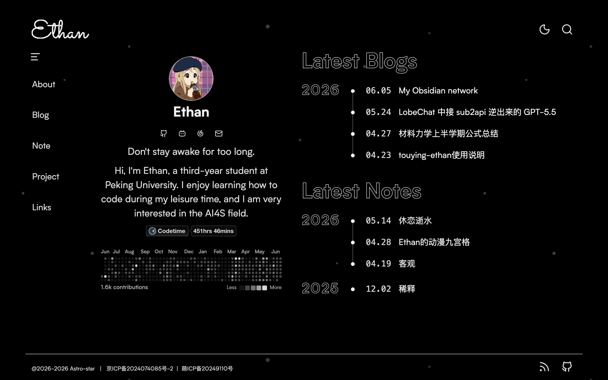
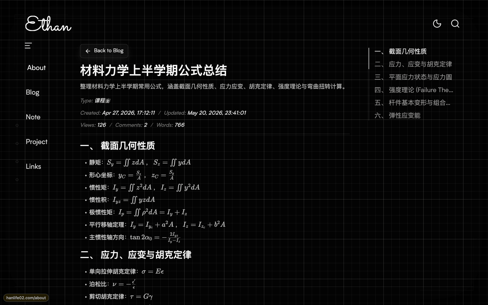
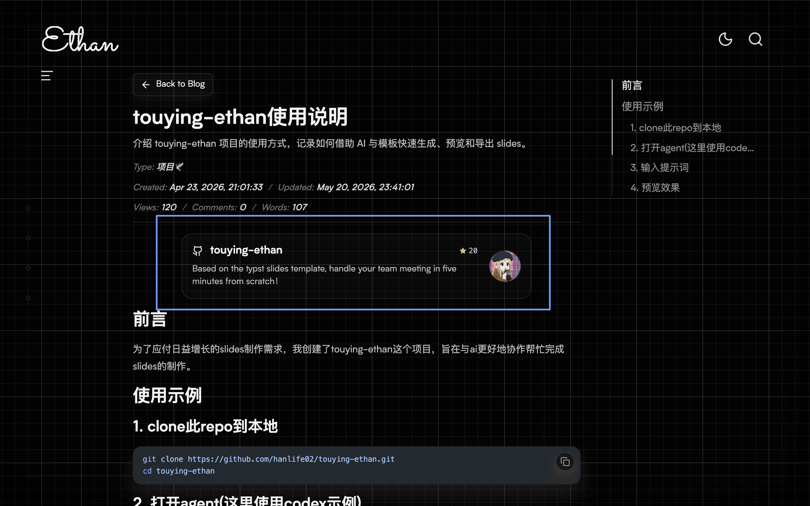
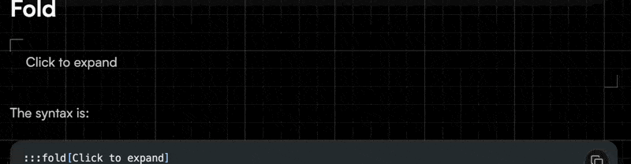
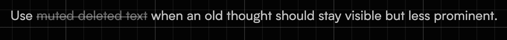

# 前言

## 我搭建博客的起源

:::fold[你或许~~不~~想了解这些事情]
设计和建设，对我有着致命的吸引力，我热衷于好看的事物，也喜欢设计好看的事物，所以玩游戏也是建造派。而对一个网站的设计和建设，同样令我着迷。

我在大一快结束的时候，刷到了某学长的博客，顿时被其主题的优雅和美丽吸引，萌生拥有自己博客的想法，最终花了一周时间才部署上。

但是在前一个博客主题作者的逐步优化下，我越来越觉得它不符合我的审美，所以也产生尝试自己搭建博客的想法，在大三上学期开始学习 Astro，一边学习前端知识一边借助 AI 帮忙搭建这款主题 **Astro-star**
:::

## repo 地址

[Astro-star](https://github.com/hanlife02/Astro-star)

# 主题内容

## 页面预览

> 好看才会让人想用的，对吧？

**你可以在 [https://hanlife02.com](https://hanlife02.com) 预览**

 

## 设计

### 文章特殊语法渲染

采用 `md` 或 `mdx` 文件，方便快速启动，后续会逐步添加新的样式在本文章更新～

#### GitHub repo 链接

```mdx
[touying-ethan](https://github.com/hanlife02/touying-ethan)
```



#### 折叠信息

点击会展开/折叠，默认折叠/展开

```mdx
:::fold[Click to expand]
Hidden content can include paragraphs, lists, and code blocks.
:::
```

```mdx
:::fold[Open by default]{open=true}
This fold starts open, so the bottom-right corner is already placed at the end of the full content area.
:::
```



#### 涂抹文字

```mdx
Hover to reveal ||this hidden inline note|| while reading.
```


#### 横线划除

```mdx
~~muted deleted text~~
```



### 自动记录时间

从 git log 里自动获取文章的创建日期和更新日期，也支持覆盖此时间自定义。

### Hover 样式

我设计了很多 Hover 的样式，为了让页面更有交互感，更加生动，减少生硬。你可以打开网站自行探索。

# 部署

## 环境准备

- **Node.js >= 22**
- **pnpm 10.30.x**
- **Git**
- PM2

## 两种部署方式

你可以直接从源码[手动部署](#手动部署)，也可以采用 [GitHub Actions 自动部署](#github-actions-自动部署)，作者更推荐后者。

### 手动部署

#### 克隆源码到服务器并安装依赖

```shell
ssh username@host

git clone https://github.com/hanlife02/Astro-star.git
cd Astro-star

pnpm install
```

#### 修改配置和文章

参考[配置与文章](#配置与文章)

#### 手动运行

安装依赖和修改配置后，可以先在服务器上做一次检查和构建：

```shell
pnpm check
pnpm build
```

构建成功后，Astro 会在 `dist/` 下生成服务端入口。本项目已经提供 `ecosystem.config.cjs`，可以直接用 PM2 启动：

```shell
pm2 start ecosystem.config.cjs
pm2 save
```

默认端口是 `4321`。如果想换端口，可以在启动前指定 `PORT`：

```shell
PORT=3000 pm2 start ecosystem.config.cjs
pm2 save
```

常用运维命令：

```shell
pm2 status
pm2 logs Blog
pm2 restart Blog
pm2 stop Blog
```

如果只是本地临时预览，不需要 PM2，可以使用：

```shell
pnpm dev
```

开发服务默认地址通常是：

```text
http://localhost:4321
```

#### 配置反向代理和 SSL 证书

参考[反向代理](#反向代理) 和 [SSL 证书配置](#ssl-证书)

### GitHub Actions 自动部署

#### fork repo 并克隆源码到本地

```shell
# 'your-github-username'修改为你的github用户名,或者你可以直接在fork后的repo里找到地址
git clone https://github.com/your-github-username/Astro-star.git
```

#### 在 repo 里添加 Variables 和 Secrets

参考 [GitHub Actions 自动部署环境变量](#github-actions-自动部署环境变量)

#### 本地修改配置和内容

参考[配置](#配置)和[文章内容](#文章内容)

#### push 到 fork 后的 repo

```shell
git add .
git commit -m "build my blog"
git push
```

Actions 执行完成后即顺利部署

#### 配置反向代理和 SSL 证书

参考[反向代理](#反向代理) 和 [SSL 证书配置](#ssl-证书)

### 配置与文章

#### 环境变量

##### 手动部署环境变量

如果只是本地预览，环境变量可以先不填；如果要部署成正式站点，建议在项目根目录创建 `.env`，按需填写下面这些变量

```dotenv
# Waline 评论服务地址；不填时评论入口会隐藏或不可用
WALINE_SERVER_URL=https://comment.example.com

# GitHub API token；用于 GitHub 仓库卡片、贡献数据等接口，避免匿名请求限流
GITHUB_TOKEN=ghp_xxxxxxxxxxxxxxxxxxxx

# CodeTime token；用于 CodeTime 徽章接口
CODETIME_TOKEN=xxxxxxxx-xxxx-xxxx-xxxx-xxxxxxxxxxxx

# Algolia 索引同步用；只有运行 pnpm algolia:sync 时才需要
ALGOLIA_WRITE_API_KEY=xxxxxxxxxxxxxxxx
ALGOLIA_ADMIN_API_KEY=xxxxxxxxxxxxxxxx
```

注意不要把真实密钥提交到公开仓库。`.env` 只放在服务器或自己的私有分支里。

##### GitHub Actions 自动部署环境变量

进入 fork 后的仓库：`Settings -> Secrets and variables -> Actions`。

非敏感部署参数放在 `Variables` 里。

| Variable       | 是否必填 | 默认值         | 说明                                                                 |
| -------------- | -------- | -------------- | -------------------------------------------------------------------- |
| `SSH_USER`     | 可选     | `ubuntu`       | SSH 用户名。                                                         |
| `SSH_PORT`     | 可选     | `22`           | SSH 端口。                                                           |
| `DEPLOY_PATH`  | 可选     | `~/Astro-star` | 服务器部署目录。确保 SSH 用户对该目录有读写权限。                    |
| `PM2_APP_NAME` | 可选     | `Astro-star`   | PM2 应用名。                                                         |
| `APP_PORT`     | 可选     | `4321`         | 站点运行端口，会作为 `PORT` 传给 `ecosystem.config.cjs` 启动 Astro。 |

凭证、token 统一放在 `Secrets` 里：

| Secret                  | 是否必填 | 用途                 | 说明                                                                                  |
| ----------------------- | -------- | -------------------- | ------------------------------------------------------------------------------------- |
| `SSH_HOST`              | 必填     | SSH / rsync 部署     | 服务器公网 IP 或仅 DNS 解析的域名，不能填写由 Cloudflare 代理的橙云域名。             |
| `SSH_PRIVATE_KEY`       | 必填     | SSH / rsync 部署     | 用于登录服务器的私钥内容。对应公钥需要提前加入服务器用户的 `~/.ssh/authorized_keys`。 |
| `WALINE_SERVER_URL`     | 可选     | 构建和服务器 `.env`  | Waline 评论服务地址；不使用评论可以不填。                                             |
| `GITHUB_TOKEN`          | 可选     | 服务器 `.env`        | GitHub API token；用于 GitHub 仓库卡片、贡献数据等接口，避免匿名请求限流。            |
| `CODETIME_TOKEN`        | 可选     | 服务器 `.env`        | CodeTime 徽章接口 token；不使用可以不填。                                             |
| `ALGOLIA_WRITE_API_KEY` | 可选     | Algolia 索引同步     | Algolia 写入索引用的 key；只有启用搜索索引同步时才需要。                              |
| `ALGOLIA_ADMIN_API_KEY` | 可选     | Algolia 索引同步     | Algolia 管理 key；用于清理已经删除文章对应的旧记录。                                  |
| `CLOUDFLARE_API_TOKEN`  | 可选     | 部署后清理 CDN 缓存  | 建议使用仅有目标站点 `Cache Purge` 权限的 API Token。                                 |
| `CLOUDFLARE_ZONE_ID`    | 可选     | 指定 Cloudflare Zone | 在 Cloudflare 站点概览页获取；需与 API Token 授权的站点一致。                         |

#### Cloudflare CDN（可选）

CDN 不是部署博客的必要条件。未配置 Cloudflare 时，GitHub Actions 会正常完成构建、上传和重启；只有同时设置 `CLOUDFLARE_API_TOKEN` 与 `CLOUDFLARE_ZONE_ID`，工作流才会在部署成功后清理旧缓存。

##### DNS 与 SSL/TLS

1. 在 Cloudflare 添加自己的域名，并按提示把域名服务器改为 Cloudflare 提供的 Nameserver。
2. 为博客域名添加指向服务器公网 IP 的 `A` 记录，并开启代理（橙云）。只用于 SSH、面板或其他不经过 Cloudflare HTTP 代理的子域名应保持“仅 DNS”。
3. 在 `SSL/TLS` 中选择 `Full (strict)`。源站需要安装有效证书，不能只依赖 Cloudflare 到访客这一段的 HTTPS。

> `SSH_HOST` 必须填写源站公网 IP 或“仅 DNS”的域名。Cloudflare 橙云不会代理普通的 SSH 22 端口；如果这里填写博客的橙云域名，Actions 会在 `Setup SSH` 的 `ssh-keyscan` 阶段失败。

##### 缓存规则

可以在 `Caching -> Cache Rules` 中按下面的顺序创建规则：

| 顺序 | 匹配范围               | 缓存行为 | Edge TTL | Browser TTL |
| ---- | ---------------------- | -------- | -------- | ----------- |
| 1    | `/api` 与 `/api/*`     | 绕过缓存 | -        | -           |
| 2    | `/_astro/*`            | 可以缓存 | 1 年     | 遵循源站    |
| 3    | 其余博客页面和静态文件 | 可以缓存 | 2 小时   | 遵循源站    |

顺序很重要：API 的绕过规则应放在普通页面规则之前。`/_astro/` 下的文件名带内容哈希，可以长期缓存；文章 HTML 使用较短的边缘缓存时间，并在每次部署后主动清理，能够兼顾访问速度和内容更新。

##### 自动清理缓存

在 Cloudflare 创建 API Token 时，将权限限制为目标站点的 `Zone -> Cache Purge -> Purge`，不要使用 Global API Key。然后把 Token 和 Zone ID 分别保存到 GitHub Actions Secrets：

```text
CLOUDFLARE_API_TOKEN
CLOUDFLARE_ZONE_ID
```

部署工作流会在服务器重启成功后调用 Cloudflare API 清理缓存，并检查 API 返回的 `success` 字段。任意一项未设置时，该步骤会输出跳过提示并正常结束，不会影响未使用 CDN 的部署。

##### 验证 CDN

部署完成后可以连续执行两次：

```shell
curl -I https://example.com/
curl -I https://example.com/
```

响应头中出现 `server: cloudflare` 表示流量已经经过 Cloudflare；`cf-cache-status` 通常会从首次访问的 `MISS` 变为后续访问的 `HIT`。对于 `/_astro/` 下的构建资源，还应看到类似 `cache-control: public, max-age=31536000, immutable` 的长期缓存响应头。

#### 配置

站点的主要配置集中在 `src/config/` 目录。新用户通常先改这四个文件：

- `src/config/site.ts`：站点名、域名、描述、头像、作者信息、导航、备案信息、版权协议、打赏二维码。
- `src/config/social.ts`：邮箱、GitHub、Bilibili、Telegram 等社交链接。把不用的链接设置为 `enabled: false`，或者直接替换为自己的地址。
- `src/config/links.ts`：友链页信息，包括站长自己的友链申请信息、友链列表和失联链接列表。
- `src/config/search.ts`：Algolia 站内搜索配置。不使用 Algolia 时保持空字符串即可。

最先要确认的是 `site.site.url`，它会作为 Astro 的 `site` 配置参与 canonical URL、RSS、sitemap 等生成。正式部署前应改成自己的域名，例如：

```ts
export const site = {
  profile: {
    name: "Your Name",
    email: "hello@example.com",
    githubUsername: "your-name",
    avatarSrc: "/avatar.svg",
    bio: "A short line about you.",
  },
  site: {
    name: "Your Site Name",
    url: "https://example.com",
    description: "A short description for your personal site.",
    iconSrc: "/site-icon.svg",
  },
};
```

本地静态资源放在 `public/` 下，引用时从根路径开始写。例如头像放在 `public/avatar.svg`，配置里写 `/avatar.svg`。

文章图片则不要放进 `public/`——那里的文件原样直出、不经压缩。原图放在文章所在分类目录的 `images/` 子目录，在 Markdown 中用相对路径写 ``，构建时会自动转成 webp 并注入宽高，`dist/` 里只保留压缩产物。`public/figures/` 只留配置里引用的友链头像。

#### 文章内容

文章和页面内容集中在 `src/content/` 目录，支持 `.md` 和 `.mdx`：

- `src/content/blog/`：博客文章。
- `src/content/note/`：短笔记、想法、阅读记录。
- `src/content/project/`：项目展示页。
- `src/content/page/`：固定页面，例如 about 和 links。

博客、笔记和项目都可以按文件夹分类，例如：

```text
src/content/blog/template/welcome-to-astro-star.mdx
src/content/note/thoughts/first-note.mdx
src/content/project/astro-star-template.mdx
```

内容条目的 frontmatter 都可以省略，省略后会使用文件路径、文件名、正文内容或 Git 时间等信息兜底；但为了 URL、列表页和 SEO 更稳定，建议主动填写。

博客或笔记示例：

```mdx
---
routeSlug: "my-first-post"
title: "My First Post"
description: "A short summary shown in list pages and metadata."
createdAt: "2026-06-15 23:05:26"
updatedAt: "2026-06-15 23:30:00"
type: "Blog"
published: true
---

# My First Post

Write your article here.
```

项目示例：

```mdx
---
routeSlug: "my-project"
title: "My Project"
description: "A short project description."
createdAt: "2026-06-15 23:05:26"
projectUrl: "https://github.com/your-name/my-project"
docUrl: "https://example.com/docs"
published: true
---

# My Project

Write your project introduction here.
```

常用字段说明：

- `routeSlug`：URL 使用的稳定短名，建议只用英文、小写和连字符。
- `title`：文章、笔记或项目标题。
- `description`：摘要，会用于列表页和 SEO 信息。
- `createdAt`：创建时间，省略时会优先从 Git 记录读取创建时间，再回退到文件系统时间；需要手动覆盖时再显式填写，格式示例：`"2026-06-15 23:05:26"`。
- `updatedAt`：更新时间。省略时同样会从 Git 记录或文件系统时间回退；格式示例：`"2026-06-15 23:30:00"`。
- `type`：文章分类或标签性质的展示字段。
- `projectUrl`：项目地址，仅项目页会展示为 GitHub 圆形图标链接。
- `docUrl`：项目文档地址，仅项目页会展示为文档圆形图标链接。
- `image`：社交分享图/SEO 图，可写 `./images/xxx.png`；留空时自动取正文第一张图。
- `published`：设置为 `false` 时可作为草稿隐藏。

固定页面放在 `src/content/page/`，常见字段如下：

```mdx
---
title: About Me
heading: About
description: This page introduces me and this site.
background: code-rain
---

## About Me

Write your page content here.
```

写完配置和文章后，建议运行：

```shell
pnpm check
pnpm build
```

如果构建失败，优先检查 frontmatter 字段是否缺失、日期是否写成字符串、图片路径是否存在，以及 MDX 语法是否闭合。

### 反向代理

Astro 服务默认监听 `4321` 端口。正式部署时不要让访客直接访问这个端口，而是让 Nginx 接收域名的 80/443 请求，再转发到本机 Astro 服务：

```text
访客 -> Nginx :443 -> Astro/PM2 :4321
```

配置前先确认：

- 域名的 `A` 记录已经指向服务器公网 IP。
- PM2 中的 Astro 应用正在运行，执行 `curl -I http://127.0.0.1:4321` 能收到响应。
- 服务器安全组和防火墙已放行 TCP 80、443；应用端口 `4321` 不需要向公网开放。

#### 使用 1Panel

在 `网站 -> 网站 -> 创建网站 -> 反向代理` 中填写：

| 配置项   | 示例                    |
| -------- | ----------------------- |
| 主域名   | `example.com`           |
| 代理地址 | `http://127.0.0.1:4321` |
| Host     | `$host`                 |

保存后访问 `http://example.com`，确认能显示博客，再继续配置证书。若使用了 `www.example.com`，需要同时添加域名解析，并把它加入网站的其他域名。

#### 手写 Nginx 配置

没有使用面板时，可以创建一个站点配置：

```nginx
server {
    listen 80;
    listen [::]:80;
    server_name example.com www.example.com;

    location / {
        proxy_pass http://127.0.0.1:4321;
        proxy_http_version 1.1;
        proxy_set_header Host $host;
        proxy_set_header X-Real-IP $remote_addr;
        proxy_set_header X-Forwarded-For $proxy_add_x_forwarded_for;
        proxy_set_header X-Forwarded-Proto $scheme;
    }
}
```

启用配置后检查并重载 Nginx：

```shell
sudo nginx -t
sudo systemctl reload nginx
```

如果返回 `502 Bad Gateway`，先检查 `pm2 status` 和 `curl -I http://127.0.0.1:4321`。本机端口无法访问通常说明 Astro 未启动或 `APP_PORT` 与反向代理填写的端口不一致。

### SSL 证书

推荐使用受浏览器信任并可自动续期的 Let’s Encrypt 证书。使用 1Panel 时，进入网站的 `HTTPS` 设置，申请 ACME/Let’s Encrypt 证书并开启 HTTPS；申请成功后再开启“HTTP 跳转 HTTPS”。

没有使用面板时，可以安装 Certbot，并让它自动修改已启用的 Nginx 配置：

```shell
sudo certbot --nginx -d example.com -d www.example.com
```

只申请实际已经解析到服务器的域名；没有使用 `www` 时去掉对应参数。完成后验证自动续期：

```shell
sudo certbot renew --dry-run
```

最终的 HTTPS 配置应包含证书路径，并把 HTTP 请求重定向到 HTTPS。下面是结构示例，具体证书路径以 Certbot 或 1Panel 生成的配置为准：

```nginx
server {
    listen 80;
    listen [::]:80;
    server_name example.com www.example.com;
    return 301 https://$host$request_uri;
}

server {
    listen 443 ssl http2;
    listen [::]:443 ssl http2;
    server_name example.com www.example.com;

    ssl_certificate /etc/letsencrypt/live/example.com/fullchain.pem;
    ssl_certificate_key /etc/letsencrypt/live/example.com/privkey.pem;

    location / {
        proxy_pass http://127.0.0.1:4321;
        proxy_http_version 1.1;
        proxy_set_header Host $host;
        proxy_set_header X-Real-IP $remote_addr;
        proxy_set_header X-Forwarded-For $proxy_add_x_forwarded_for;
        proxy_set_header X-Forwarded-Proto $scheme;
    }
}
```

如果已经开启 Cloudflare 橙云代理：

- Cloudflare 的 `SSL/TLS` 模式应使用 `Full (strict)`，不要使用会导致重定向循环和源站明文传输的 `Flexible`。
- Let’s Encrypt 的 HTTP 验证失败时，可以暂时把 DNS 记录切换为“仅 DNS”，签发完成后再恢复橙云；也可以改用 DNS 验证。
- 也可以在 Cloudflare 创建 Origin CA 证书并安装到源站，但该证书只受 Cloudflare 信任。若绕过 Cloudflare 直接访问源站，浏览器会提示证书不受信任。

配置完成后依次验证源站服务、HTTPS 和跳转：

```shell
curl -I http://127.0.0.1:4321
curl -I http://example.com
curl -I https://example.com
```

预期结果是 Astro 本机端口返回正常响应，HTTP 域名返回 `301` 或 `308` 跳转，HTTPS 域名返回 `200`。
